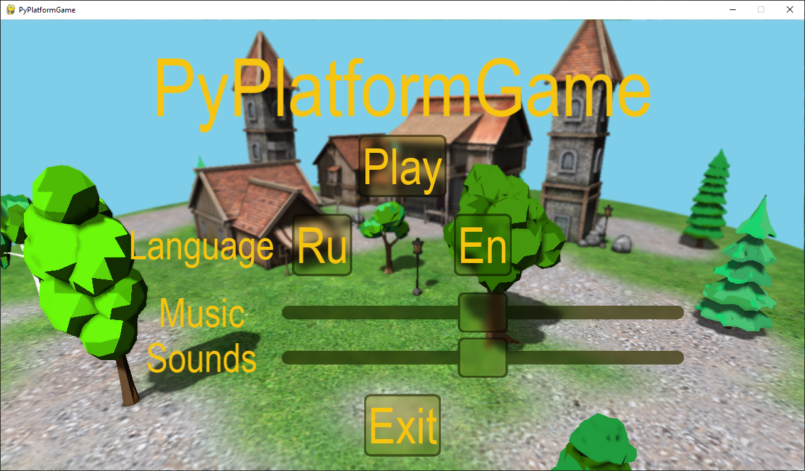
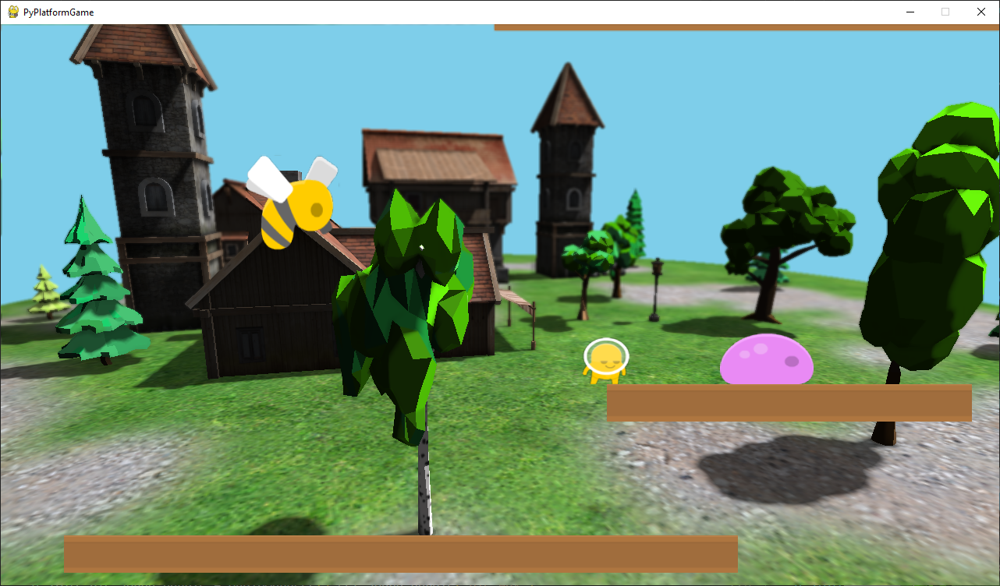
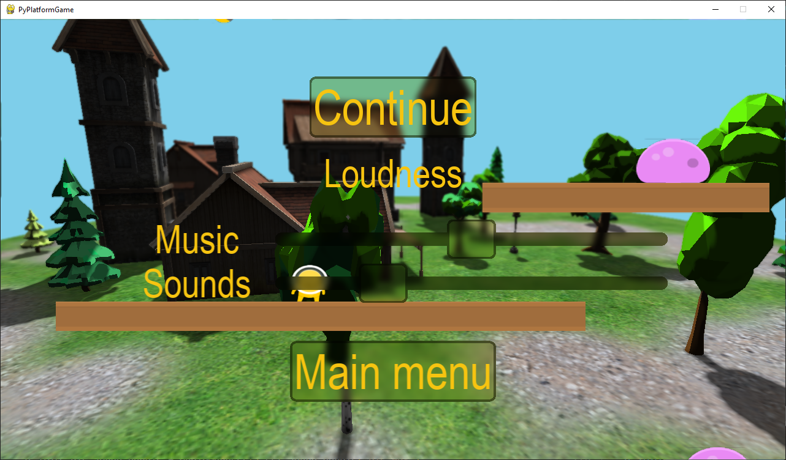
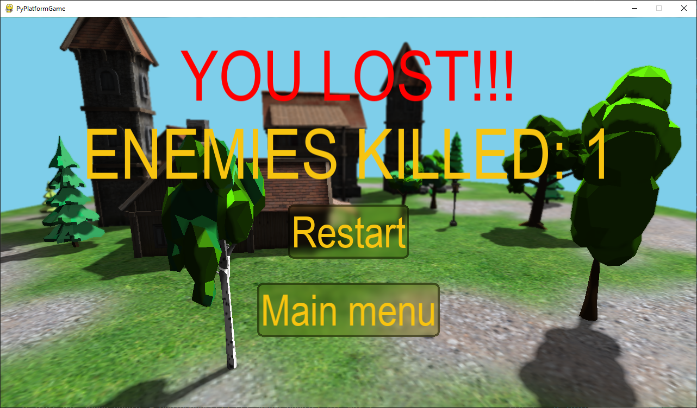

Пользовательская документация
===============================

--------------------------------------------------------------------
В игре можно встретить несколько пользовательских интерфейс-экранов:
--------------------------------------------------------------------
* Стартовый / Меню (Домашний экран). На нем можно произвести смену языка игры (RU / ENG), настроить громкость звуков и музыки, а также выключить или же начать игру.

* Экран игровой сессии с игровым уровнем, врагами, главным персонажем и 3Д сценой. 

* Экран паузы. На нем можно настроить громкость звуков и игровой музыки, а также продолжить игру или же вернуться в Меню.

* Экраны победы и поражения. На них возможно вернуться в меню и перезапустить игровую сессию.

------------------------
Описание игровой сессии
------------------------
* Главная задача это уничтожить всех врагов в сцене. 
* Для передвижения влево и вправо требуется зажимать клавиши A и D соответственно. Прыжок = пробел. 
* Будьте внимательны, падение в пропасть приведет к смерти!
* Также если вы заденете врага ваш герой умрет.
* Для того чтобы уничтожить врага, нужно направить на него оружие нажав клавишу P.