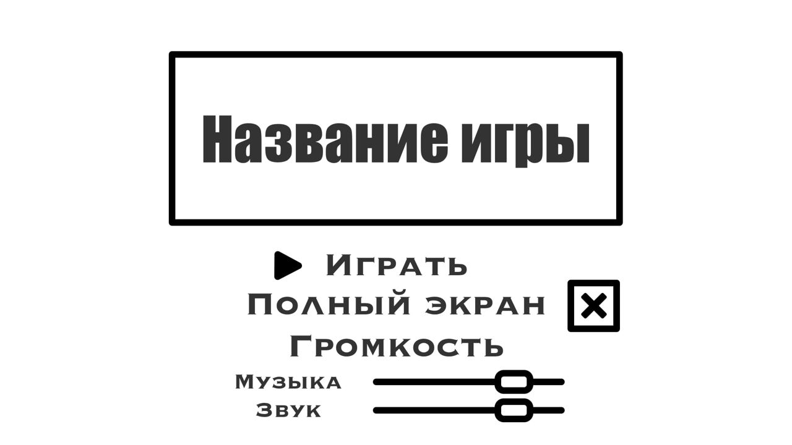
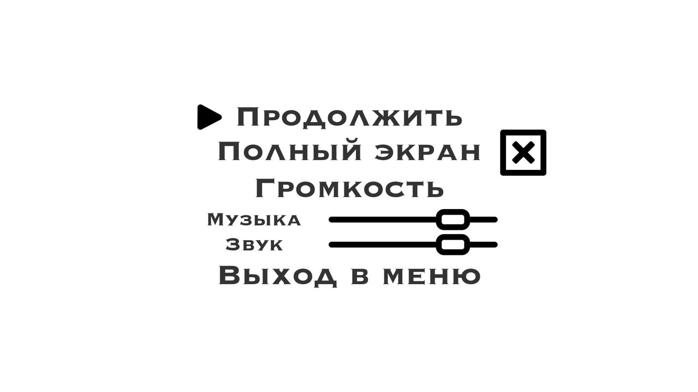

## 1. Постановка задачи:

### 2.5D платформер. Управляемый игроком персонаж может бегать и прыгать по платформам, нанося урон противникам.

## 2. Фичи:
 - Увлекательный геймплей)
 - Обработка ввода игрока
 - Простой ИИ противников
 - 3D рендер на OpenGL
 - Звуки и музыка

## 3. Список сторонных модулей:
 - PyOpenGL для рендера
 - PyGame для получения ввода и музыки
 - PyAssimp для загрузки 3D моделей
 - Pillow для загрузки текстур
 - NumPy и PyGLM для математики

## 4. Макет интерфейса и описание элементов
- Меню. Можно запустить игру, настроить громкость и полноэкранный режим
- В процессе игры из интерфейса присутствует только полоса здоровья игрока
- Есть меню паузы, позволяющее поменять настройки и вернуться в главное меню

